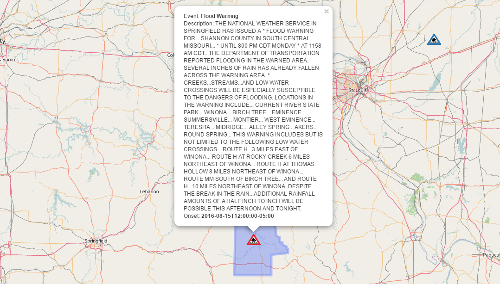
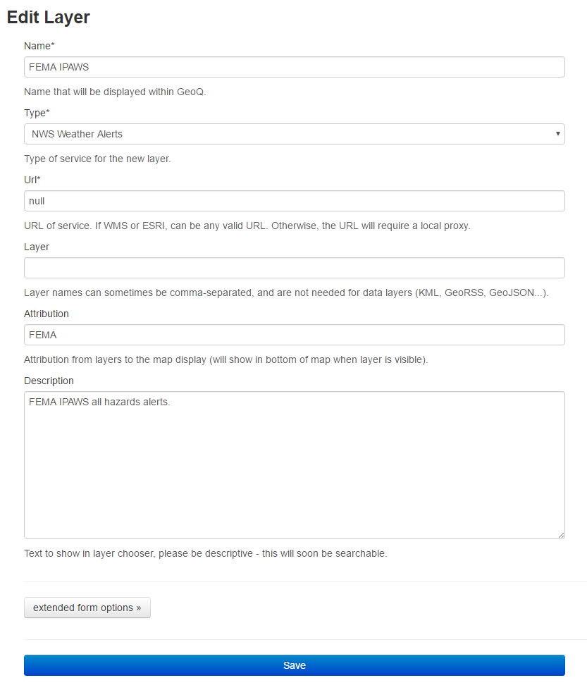

### NWS Icons via FEMA IPAWS Data Feed

This plugin (part of [QeoQ](https://github.com/ngageoint/geoq)) is used for displaying National Weather Service alerts on a Leaflet Map.


Sources: Leaflet, OpenStreetMap, FEMA

#### Usage
This is a leaflet plugin consisting of a plugin that extends L.GeoJson and a custom LayerGroup that extends L.LayerGroup.

This plugin is integrated into GeoQ and uses some of the system components that are a part of the GeoQ platform.

These include:
- Layer object (user configurable)
- Core Settings (core.settings)

#### Configuration
A settings object must be addded to core.setting via the backend.

The name must be `FEMA_IPAWS`.

Value is:
```
{
  "FEMAkey":"My FEMA Key Here",
  "proxy":"Path to Proxy",
  "iconPath":"/static/leaflet/NWSIcons/"
}
```

Additionally, you must create a layer in GeoQ that is of the type `NWS Weather Alerts`:



The only required fields are Name and Type, all other fields can be left blank or null.

#### Coding Style

There are two main pieces of the puzzle:
- L.NWSIconsLayer
- L.NWSLayerGroup

L.NWSIconsLayer extends L.GeoJSON, L.NWSLayerGroup extends L.LayerGroup.

##### L.NWSIconsLayer
The main pieces of the extended GeoJSON class are the ajax requests and parser.

###### Loading
Currently, this plugin performs a POST ajax request to a special endpoint on the GeoQ server that retrieves a copy of the FEMA IPAWS NWS data feed.

The key required to access this feed is stored in core.setting. There is a flag located in the `load()` function on the POST request. It is set to the value of options.debug in the NWSIconsLayer. When `develop == true`, the FEMA development server is polled. When `develop == false`, the production server is polled.

To avoid overloading FEMA servers, the endpoint on the GeoQ api is used to cache the FEMA feed (updated every 1/2 hour). This allows every active work cell on GeoQ to poll the local sever as frequently as required.

###### GeoCoding vs. Timed
Presently, there are two ways to put FEMA IPAWS data on the map. Using the `geocode()` function will pull information from the Census TigerWeb server which provides the FIPS-6 (we convert to SAME) code(s) for the current map viewport.

This feature would be helpful in limiting the amount of information on the map to just the area being looked at. However, this would also require constant updates to the map viewport on zoom and move events.

The default functionality is to place every NWS icon on the map. These icons are refreshed every 5 minutes automatically.

To switch between geocoding for the viewport and timed loading, one needs to modify `_isParse` and set to `true`, and also uncomment several lines of code in `initialize()`. A future update may eliminate the actual step of having to mess with the code and instead utilize variables stored in core.setting.

###### Parsing
The parser is set to convert the FEMA IPAWS xml feed into an array of json objects for use in the layer. The parser is integrated to use `_isParse`, if that variable is set to `true`, the SAME codes geocoding method is used to place markers only in the viewport, otherwise all markers are placed on the map.

##### L.NWSLayerGroup
The layer group is an extension of the L.LayerGroup class. This layer group object is utilized in L.NWSIconsLayer as the layer where all markers, polygons, and popups are placed.

The purpose of this layer group extension is to overwrite the `addLayer()` function which is called when layer objects (in our case NWS icons) are placed on the map.

Through this `addLayer()` function we have bound events to the marker that place the polygon of each weather system or alert on the map on mouseover and on click. If one wanted to bind more events to each marker, this would be the function to modify.

#### Support
This plugin was written and tested on Leaflet 0.7 stable, it should likely work on Leaflet 1.0 as many core components were left unchanged or overridden, but this has yet to be tested.
